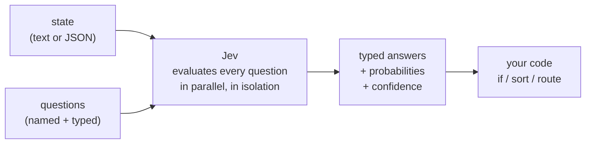
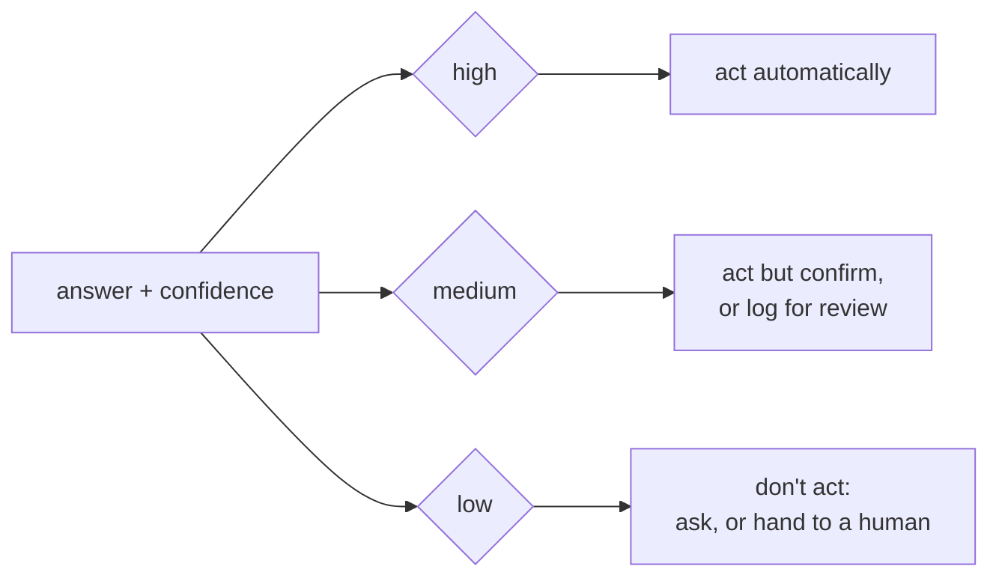
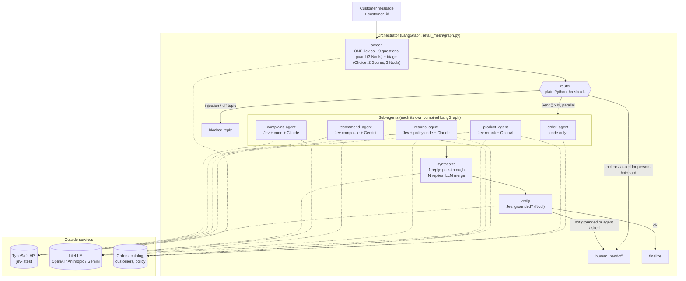
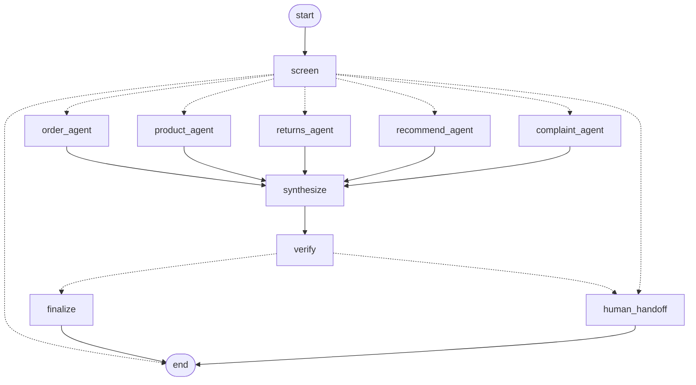
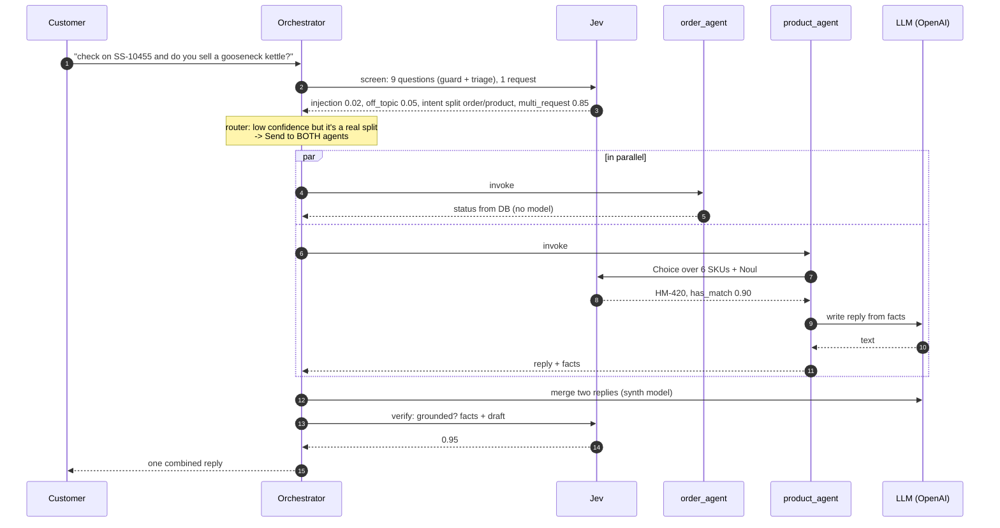

# Jev from zero: a retail multi-agent system where Jev makes the decisions

This repo does two things. First it teaches TypeSafe's **Jev** model from scratch, with six small scripts you can run in a minute each. Then it builds **ShopSense**, a retail customer-service system where Jev is the decision layer of a LangGraph orchestrator that calls five sub-agents, each one backed by a different LLM (OpenAI, Anthropic, Gemini) or by plain code.

Everything is Python. Everything runs offline with no API keys (there's a mock Jev and template replies), and switches to the real thing when you set the keys.

Docs used throughout: https://docs.typesafe.ai/introduction

---

## Contents

- [Part 1. What Jev actually is](#part-1-what-jev-actually-is)
- [Part 2. The three question types](#part-2-the-three-question-types)
- [Part 3. Confidence](#part-3-confidence)
- [Part 4. How to design with it](#part-4-how-to-design-with-it)
- [Part 5. Lessons you can run](#part-5-lessons-you-can-run)
- [Part 6. ShopSense: the retail project](#part-6-shopsense-the-retail-project)
- [Part 7. One message, end to end](#part-7-one-message-end-to-end)
- [Part 8. Running it](#part-8-running-it)
- [Part 9. Taking it to production](#part-9-taking-it-to-production)
- [Glossary](#glossary)

---

## Part 1. What Jev actually is

Most models you've used (GPT, Claude, Gemini) are text generators. You ask a question, they write an answer. When your *code* needs a decision ("is this a refund request?", "how angry is this customer?"), you end up asking a text generator to write JSON, then parsing it, then hoping the label is spelled right and the number means something.

Jev is built the other way round. TypeSafe calls it a **System One** model: it doesn't generate text at all. You send it

- a **state**: the thing being judged (a message, a document, a JSON blob of your app's data), and
- a set of named, typed **questions** about that state,

and you get back typed answers with probabilities. Your code reads `answer.choice` or `answer.score` or `answer.noul` and branches on it. There's nothing to parse.



### The important bit: what Jev is *not*

Jev doesn't write replies, call tools, or hold a conversation. You can't drop it in where GPT or Claude sits inside an agent framework and expect it to reason step by step.

So when this repo says "Jev is the orchestrator", here's precisely what that means:

| Job | Who does it |
|---|---|
| Decide what the customer wants, how upset they are, whether it's safe to automate | **Jev** (typed questions) |
| Turn those numbers into a decision: which agent, whether to escalate, whether to refund | **Python** (thresholds you own) |
| Look things up, do date maths, apply policy | **Python** |
| Write the sentence the customer reads | **An LLM** (or a template) |
| Check the reply doesn't invent facts | **Jev** again |

The LLM never decides what happens next. It only writes. That's the design idea the whole project hangs on, and it's why the system is cheap, fast, and easy to test.

### LLM vs System One, side by side

| | Text LLM asked for JSON | Jev |
|---|---|---|
| Output | A string you hope is valid JSON | Typed values by construction |
| Uncertainty | Usually none, or a made-up "confidence: 0.9" | Real probability distribution over the options |
| Many questions | One long prompt; questions bleed into each other | Each question evaluated separately, in parallel, in one request |
| Cost of adding a question | More tokens, slower, more drift | Barely changes latency |
| Good for | Writing, reasoning, tool use | Classification, scoring, routing, yes/no checks |

---

## Part 2. The three question types

TypeSafe calls these **primitives**. You can mix all three in one call.

### Choice: pick one option from a list

```python
"intent": {
    "type": "choice",
    "instructions": "The customer's main request",
    "criteria": {                      # key -> description
        "order_status": "Asking where an order is",
        "return_refund": "Wants to return something or get money back",
        "product_question": "Asking about a product",
    },
}
```

Answer:

```json
{"type": "choice", "choice": "return_refund", "confidence": 0.78,
 "probabilities": {"return_refund": 0.85, "order_status": 0.15, "product_question": 0.0}}
```

The keys are yours. They come back exactly as you wrote them, so `if a.choice == "return_refund"` just works. Keys can be anything: intents, SKUs, line numbers in a document, function names.

### Score: place the state on an ordered rubric

```python
"frustration": {
    "type": "score",
    "instructions": "How frustrated the customer sounds",
    "criteria": ["Calm", "Annoyed but civil", "Very upset"],   # level 0, 1, 2
}
```

Answer:

```json
{"type": "score", "score": 1.2, "confidence": 0.65,
 "legend": {"0": "Calm", "1": "Annoyed but civil", "2": "Very upset"},
 "probabilities": {"0": 0.1, "1": 0.6, "2": 0.3}}
```

`score` is a float between 0 and the top level, so you can write `if frustration.score >= 1.5`. Order matters here: levels are a scale, not a bag of labels. If your options don't have a natural order, use Choice.

### Noul: is this statement true?

```python
"safety_issue": {
    "type": "noul",
    "instructions": "The message describes an injury, fire, shock or other safety hazard",
}
```

Answer:

```json
{"type": "noul", "noul": 0.92}
```

A single probability between 0 and 1. Write the instruction as a *statement*, not a question. "The customer asks for a refund" reads better to the model than "Does the customer want a refund?" (both work, statements tend to be cleaner).

### Calling it

Over HTTP:

```bash
curl -X POST https://api.typesafe.ai/v1/systemone \
  -H "Authorization: Bearer $TYPESAFE_API_KEY" \
  -H "Content-Type: application/json" \
  -d '{
    "model": "jev-latest",
    "state": {"message": "My earbuds stopped charging, I want a refund"},
    "questions": {
      "intent":  {"type": "choice", "instructions": "Main request",
                  "criteria": {"return_refund": "Return or refund", "order_status": "Where is my order"}},
      "refund":  {"type": "noul", "instructions": "The customer asks for money back"}
    }
  }'
```

With the Python SDK (`pip install typesafe-sdk`, Python 3.10+):

```python
from typesafe_sdk import TypeSafeClient, Choice, Noul, Score

client = TypeSafeClient()          # reads TYPESAFE_API_KEY, defaults to jev-latest

r = client.system_one(
    state={"message": "My earbuds stopped charging, I want a refund"},
    questions={
        "intent": Choice(instructions="Main request",
                         criteria={"return_refund": "Return or refund",
                                   "order_status": "Where is my order"}),
        "refund": Noul(instructions="The customer asks for money back"),
    },
)
r.answers["intent"].choice        # "return_refund"
r.answers["intent"].confidence    # e.g. 0.9
r.answers["refund"].noul          # e.g. 0.97
```

The SDK also accepts plain dicts for questions, which is what this repo uses (dicts are easy to keep in one file, easy to log, and the mock can read them). There's an async client too, `AsyncTypeSafeClient`, with the same `system_one` method.

### State: give it what a human judge would need

State can be a string, but a JSON object is usually better:

```python
state = {
    "message": "The headphones crackle in the left ear. I want my money back.",
    "order":   {"id": "SS-10421", "delivered": "2026-09-20", "price": 249.0},
    "policy":  "Defective items: 90 days. Everything else: 30 days.",
}
```

Think of it as the folder you'd hand a colleague before asking them a quick question. Text only (no images yet), and English works best.

---

## Part 3. Confidence

This is the part that makes Jev useful for orchestration, so it's worth slowing down.

Every Choice and Score answer comes with `probabilities` (the full distribution) and `confidence`, a single 0 to 1 number summarising how peaked that distribution is.

- All the probability on one option → confidence 1.0
- Probability spread evenly → confidence 0.0

For a Choice with `n` options:

```
confidence = (p_max - 1/n) / (1 - 1/n)
```

So with 3 options, probabilities `(0.9, 0.06, 0.04)` give confidence 0.85, and `(0.4, 0.33, 0.27)` give 0.10.

For a Score the formula also accounts for *distance*: being torn between "Calm" and "Annoyed" (neighbours) is less uncertain than being torn between "Calm" and "Very upset" (opposite ends).

Nouls don't get a confidence field. The probability already is one: 0.5 means "no idea", 0.02 and 0.98 both mean "sure". If you want a comparable number, use `abs(2 * p - 1)`.

### Using it: three bands, thresholds that scale with risk



The right threshold depends on what happens if you're wrong. Showing a tracking link at confidence 0.5 is fine. Issuing a $249 refund at 0.5 is not. In ShopSense, every threshold lives in one dataclass, `retail_mesh/config.py::Thresholds`, so you tune behaviour by editing numbers, not prompts.

One subtle case the router handles: "check my order **and** do you sell kettles?" really is two requests. Jev will split the probability between `order_status` and `product_question`, so confidence on the top intent comes out *low*. That's not confusion; it's an accurate description of the message. The router checks `multi_request` (a Noul) and the top-two probability mass before deciding it's uncertain, and if it's a genuine split it sends the message to *both* agents.

---

## Part 4. How to design with it

### Rule 1: one question, one gut check

If a sharp person couldn't answer it in a few seconds, split it. Don't ask "is this return eligible?"; that needs dates, policy rules and maths. Ask "why does the customer want to return it?" and "has it been opened?" and do the rest in Python.

### Rule 2: arithmetic, dates, lookups and money stay in code

Jev judges language. Your code knows today's date, the return window, the price and who owns which order. Never ask a model "is 20 days within 30 days?"

### Rule 3: ask more questions than you need

Questions run in parallel and cost almost nothing extra, so ShopSense's triage asks six at once (intent, multi-request, complexity, frustration, wants-human, has-order-ref) even though most messages only need two. This is the **speculative fan-out** pattern from the docs.

### The five patterns used in this repo

| Pattern | What it is | Where in ShopSense |
|---|---|---|
| **Intent routing** | Choice picks the handler: code, a specialist LLM, or a human | `graph.screen` + `router.plan_route` |
| **Confidence-gated routing** | The answer says *what*, confidence says *whether* | intent floor, big-refund check, item-pick check |
| **Speculative fan-out** | Many questions in one request, code uses what's relevant | screen (9 questions: guard + triage), complaint (4) |
| **Composite scoring** | Several atomic Scores combined with weights in code | `recommend_agent` (one Score per product, one call) |
| **Re-ranking / verification** | Choice over candidate IDs; Noul to check output against facts | `product_agent.rerank`, `graph.verify` |

---

## Part 5. Lessons you can run

Each script is short and standalone. Run them in order. Without a key they use the mock; with `TYPESAFE_API_KEY` set they call the real model and you'll see real probabilities.

| File | What you learn |
|---|---|
| `learn/01_hello_jev.py` | One Noul. Prints the exact HTTP body sent to the API. |
| `learn/02_three_primitives.py` | Choice, Score and Noul in one call; reading probabilities and confidence |
| `learn/03_structured_state.py` | JSON state; judgments from Jev, date maths in Python |
| `learn/04_confidence_gating.py` | Act / confirm / ask bands with risk-dependent thresholds |
| `learn/05_composite_scoring.py` | Six questions in one request, combined with weights you own |
| `learn/06_minimal_langgraph_router.py` | The whole project idea in 50 lines: Jev classifies, a LangGraph conditional edge routes |

```bash
python learn/01_hello_jev.py
python learn/06_minimal_langgraph_router.py
```

Once lesson 6 makes sense, the full project is the same shape with more nodes.

---

## Part 6. ShopSense: the retail project

### The problem

An online store gets a stream of customer messages: where's my order, do you sell X, I want to return this, I need a gift idea, this product hurt me. Some can be answered from the database. Some need a well-written reply. Some must go to a person. Some contain two requests at once. A few are attacks.

Sending every message through a big LLM that "decides what to do" is slow, expensive and hard to test. ShopSense puts Jev in front: a few cheap, typed decisions per message, then exactly the right worker.

### System architecture



### The LangGraph graph (generated by `python main.py --mermaid`)



Dotted lines are conditional edges. The one out of `screen` returns a list of `Send(...)` objects, which is how LangGraph runs several nodes in parallel in the same step. Their results land in `agent_outputs`, a list with an `operator.add` reducer, so parallel writes merge instead of overwriting each other.

### Who decides what

| Decision | Jev question | Code that acts on it |
|---|---|---|
| Is this an attack? | `prompt_injection` Noul | `>= 0.7` → block |
| Is it about shopping at all? | `off_topic` Noul | `>= 0.8` → polite redirect |
| What do they want? | `intent` Choice (6 options) | confidence `< 0.5` → human |
| Two requests in one? | `multi_request` Noul + intent probabilities | second intent with `p >= 0.15` gets its own agent |
| Too hard and too heated to automate? | `complexity` + `frustration` Scores | both `>= 1.5` → human |
| Asked for a person? | `wants_human` Noul | `>= 0.7` → human, always |
| Which product matches? | `best_match` Choice over SKUs | rank by probability |
| Which purchased item is meant? | `item` Choice over order/SKU pairs | confidence `< 0.4` → human |
| Why return it, what do they want? | `reason`, `resolution` Choices, `item_opened` Noul | policy window maths |
| How good a gift is each product? | one `fit_<sku>` Score per product | `0.7*fit + 0.2*in_stock + 0.1*conf` |
| How bad is the complaint? | `severity` Score, `safety_issue`, `legal_threat` Nouls | safety/legal → human; credit from a table |
| Did the reply make things up? | `grounded` Noul over facts + reply | `< 0.6` → human with the draft attached |

### The five sub-agents

Each is a separate compiled LangGraph graph with its own state type (`agents/base.py::AgentState`). The orchestrator only calls `GRAPH.invoke(...)` and reads back a small dict: reply, facts, `needs_human`, reason. That narrow contract is deliberate. Later you can move any agent into its own service (behind A2A, an HTTP API, another team's deployment) and the router won't notice.

**order_agent** (no LLM, no Jev)

```
lookup (regex order id, ownership check, or latest order) -> respond (template)
```

Jev already decided this is an order question. Answering it is a database read, so it's code. Also refuses to show an order to a customer who doesn't own it.

**product_agent** (Jev + OpenAI by default)

```
retrieve (keyword match + budget filter in code) -> rerank (Jev Choice over SKUs + Noul "catalog has a match") -> respond (LLM)
```

The rerank asks one Choice whose options are the candidate SKUs. The probability of each option is its relevance. If the "catalog has a match" Noul is low, it says so instead of recommending something unrelated.

**returns_agent** (Jev + policy code + Claude by default)

```
locate (order id regex, else Jev Choice over every delivered item) -> assess (Jev: reason, resolution, opened)
-> decide (Python: days since delivery, window by reason/category, final sale) -> respond (LLM)
```

`check_eligibility()` is pure Python and unit-tested. Refunds over $200 need resolution confidence of 0.8 or they go to a person.

**recommend_agent** (Jev + Gemini by default)

```
candidates (budget filter) -> score (ONE Jev call, one Score per product) -> rank (weighted formula) -> respond (LLM)
```

Six products means six Score questions in a single request. The weights are three constants at the top of the file.

**complaint_agent** (Jev + code + Claude by default)

```
assess (Jev: severity Score 0-3, safety, legal, wants compensation) -> decide (code) -> respond (LLM)
```

Anything that looks like a safety incident or a legal threat goes to a human with P1 priority and no automated offer. Otherwise store credit comes from a severity table (doubled for gold-tier customers).

### Why LLM replies have a template fallback

`llm.complete()` always takes a `fallback` string built from the same facts. In mock mode that's what you see. In live mode it's what the customer gets if the provider times out or the key is wrong. The LLM makes replies nicer; it is never the only thing between the customer and an answer.

---

## Part 7. One message, end to end

Here's the trickiest demo scenario, a two-part message from customer C-1002, with the actual trace the program prints:

> Can you check on order SS-10455 and also tell me if you sell a gooseneck kettle?

```
· screen.guard: prompt_injection=0.02 abusive=0.03 off_topic=0.05
· screen.triage: intent=order_status(0.39) multi_request=0.85 complexity=1.00(0.70) frustration=0.20(0.70) wants_human=0.05 has_order_ref=0.95
· router: ['order_agent', 'product_agent'] because intent=order_status (conf 0.39) + product_question (p=0.49)
· order_agent: SS-10455 status=processing
· order_agent: reply via code
· product_agent: keyword retrieval (budget=None) -> ['HM-420', 'EL-110', 'EL-205', 'EL-300', 'HM-410', 'AP-510']
· product_agent: Jev best=HM-420 conf=0.99 has_match=0.90
· product_agent: reply via template
· synthesize: merged 2 agent replies via template
· verify: grounded=0.95
· finalize: sent to customer

REPLY: Order SS-10455 (Brewline Pour-Over Coffee Kit) is being prepared and hasn't shipped yet.
       Current estimate: Oct 10, 2026. Yes, we carry the Kettle Pro Gooseneck Kettle ($69.00, in stock). ...
(Jev calls for this message: 3)
```

(Numbers are from the mock. With the real model they'll differ; the flow won't.)



Read the trace line by line:

1. **screen** asked nine questions in one call: three guard Nouls and six triage questions. The guard answers are checked first; nothing suspicious.
2. On the triage answers, the intent confidence is only 0.39, which on its own would send this to a human. But `multi_request` is 0.85 and the top two intents hold almost all the probability, so the router reads it correctly as two clear requests.
3. **router** sent the ticket to two agents with `Send`. They ran in the same LangGraph step.
4. **order_agent** answered from the order table. No model involved.
5. **product_agent** narrowed the catalog with keywords, then let Jev pick the best SKU (one Choice over six options) and confirm the catalog really has a match.
6. **synthesize** merged two replies into one.
7. **verify** checked every order number and price in the draft against the facts the agents used.

Three Jev calls for a message that touched two agents and was safety-checked twice.

### Jev calls per message type

| Message | Calls | Which |
|---|---|---|
| Blocked (injection / off-topic) | 1 | screen |
| Unclear / asked for a person | 1 | screen |
| Order status | 2 | screen, verify |
| Product question | 3 | + rerank |
| Recommendation | 3 | + one call scoring every candidate |
| Complaint | 3 | + assess |
| Return (order id of a one-item order) | 3 | + assess |
| Return (multi-item order, or item only described) | 4 | + item pick, assess |
| Two-part message | 2 + each agent's own | |

The full request/response payload for every case is in [user_flow.md](user_flow.md).

---

## Part 8. Running it

### Project layout

```
jev-retail-orchestrator/
├── README.md
├── requirements.txt
├── .env.example
├── user_flow.md                  # every case end to end, with payloads
├── api.py                        # FastAPI backend: POST /v1/chat
├── main.py                       # demo runner / CLI
├── learn/                        # zero-to-hero lessons, run in order
│   ├── _setup.py
│   ├── 01_hello_jev.py
│   ├── 02_three_primitives.py
│   ├── 03_structured_state.py
│   ├── 04_confidence_gating.py
│   ├── 05_composite_scoring.py
│   └── 06_minimal_langgraph_router.py
├── retail_mesh/
│   ├── config.py                 # env, model per agent, ALL thresholds
│   ├── data.py                   # fake orders, catalog, customers, policy
│   ├── questions.py              # every Jev question in one place
│   ├── jev_client.py             # SDK wrapper -> Answer dataclass, call log
│   ├── mock_jev.py               # offline stand-in, same answer shapes
│   ├── llm.py                    # LiteLLM wrapper with template fallback
│   ├── state.py                  # orchestrator state (TypedDict + reducers)
│   ├── router.py                 # pure function: Jev answers -> plan
│   ├── graph.py                  # the orchestrator LangGraph
│   └── agents/
│       ├── base.py               # AgentState, shared helpers
│       ├── order_agent.py
│       ├── product_agent.py
│       ├── returns_agent.py
│       ├── recommend_agent.py
│       └── complaint_agent.py
└── tests/
    ├── test_router.py            # every routing branch, hand-made answers
    ├── test_policy.py            # return-window maths
    ├── test_graph_e2e.py         # whole graph, mock Jev, incl. outage + hallucination
    └── test_api.py               # HTTP contract
```

### Setup

```bash
python -m venv .venv && source .venv/bin/activate
pip install -r requirements.txt
cp .env.example .env
```

### Three ways to run

**1. Fully offline (no keys).** Mock Jev, template replies. Good for learning the flow.

```bash
python main.py                 # all 10 scenarios
python main.py --only 8        # just the two-part message
python main.py -m "Where is SS-10421?" -c C-1001
python main.py --chat -c C-1002

uvicorn api:app --reload --port 8000     # HTTP backend
curl -s localhost:8000/v1/chat -H 'content-type: application/json' \
     -d '{"customer_id":"C-1001","message":"Where is my order SS-10421?"}'
```

**2. Real Jev, template replies.** Put `TYPESAFE_API_KEY` in `.env` (from https://console.typesafe.ai/keys). Now every decision comes from the real model. This is the most useful mode for tuning thresholds, because replies stay deterministic and you're only looking at routing.

**3. Everything live.** Also add `OPENAI_API_KEY`, `ANTHROPIC_API_KEY` and/or `GEMINI_API_KEY`, and set the model per agent:

```bash
PRODUCT_AGENT_MODEL=openai/gpt-4o-mini
RETURNS_AGENT_MODEL=anthropic/claude-sonnet-4-5
RECOMMEND_AGENT_MODEL=gemini/gemini-2.5-flash
COMPLAINT_AGENT_MODEL=anthropic/claude-sonnet-4-5
SYNTH_MODEL=openai/gpt-4o-mini
```

These are LiteLLM model strings, so any provider LiteLLM supports works (Bedrock, Azure, Vertex, a local Ollama model). Use whichever model names your accounts have. If only one provider key is set, point every agent at that provider.

### Tests

```bash
python -m pytest -q
```

22 tests, no network, under a second. The router tests build `Answer` objects by hand, which is the main payoff of keeping routing as a pure function: you can test "what happens at confidence 0.49" without calling anything.

### About the mock

`mock_jev.py` is keyword matching dressed up in Jev's answer format. It returns the same fields and computes confidence with TypeSafe's published formulas, so the rest of the code can't tell the difference. It is not a model and its numbers mean nothing. Use it to learn the flow and run tests; use the real API for anything you'd judge quality on.

---

## Part 9. Taking it to production

**Use the async client.** `AsyncTypeSafeClient` has the same `system_one` method. LangGraph nodes can be `async def`, and the parallel agents will then share one event loop.

**Retries and timeouts.** Both SDK clients accept `retry=RetryPolicy(...)` and `timeout=`. Routing calls are on the hot path, so keep the timeout tight and decide in code what happens on failure (in a support desk, "route to human" is a safe default).

**Log every decision.** `get_jev().log` already records each call's tag, question count and latency. In production, store the state, the questions, the answers and the action taken. That log becomes your evaluation set.

**Tune thresholds with data, not vibes.** Label a few hundred real messages with the right route. Replay them through Jev once, save the answers, then sweep thresholds offline (it's just Python over saved numbers) and pick values that trade automation rate against mistakes the way the business wants. When Jev releases a new version, replay the same set and compare.

**Pin the model.** `jev-latest` moves. For production, pin a specific version via `TYPESAFE_DEFAULT_MODEL` or the `model=` argument, and upgrade on purpose.

**Moving sub-agents out.** Each agent returns the same small dict. To run, say, `returns_agent` as its own service, replace `make_agent_node("returns_agent")` with a node that calls that service and returns the same dict. Nothing else changes.

**Real data.** Replace `data.py` with calls to your order system, catalog search and CRM. The ownership check in `owned_order()` is the kind of thing that must survive that move.

**Known limits.** Jev takes text only (no images yet) and is strongest in English. TypeSafe publishes a "jaggedness" page listing the current model's weak spots; read it before trusting a new question type.

---

## Glossary

| Term | Meaning |
|---|---|
| **System One model** | TypeSafe's term for a model that makes fast structured judgments instead of generating text. Jev is the first one. |
| **State** | The content being judged. String, JSON object or array. |
| **Question** | A named, typed ask about the state: Choice, Score or Noul. |
| **Choice** | Pick one option from a dict of `key: description`. |
| **Score** | Place the state on an ordered list of levels. Returns the expected level. |
| **Noul** | Probability that a statement is true. |
| **Confidence** | 0 to 1 summary of how peaked a Choice/Score distribution is. |
| **Speculative fan-out** | Asking extra questions in the same call because they're nearly free. |
| **Send** | LangGraph's way to dispatch state to several nodes in parallel. |
| **Reducer** | How LangGraph merges writes to the same state key (`operator.add` concatenates lists). |
| **Grounded** | Every fact in the reply appears in the data the agent used. |

## Links

- Introduction: https://docs.typesafe.ai/introduction
- Quick start: https://docs.typesafe.ai/introduction/quickstart
- Confidence: https://docs.typesafe.ai/confidence
- Intent routing pattern: https://docs.typesafe.ai/patterns/intent-routing
- Python SDK: https://docs.typesafe.ai/sdk/python
- Full docs index for agents: https://docs.typesafe.ai/llms.txt
- LangGraph: https://langchain-ai.github.io/langgraph/
- LiteLLM: https://docs.litellm.ai/
